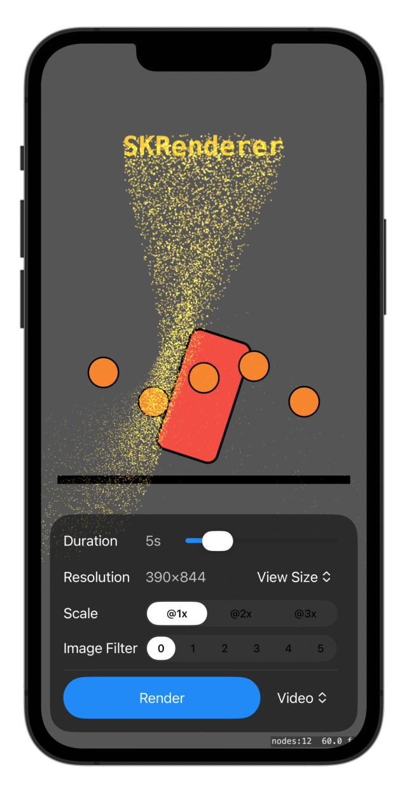
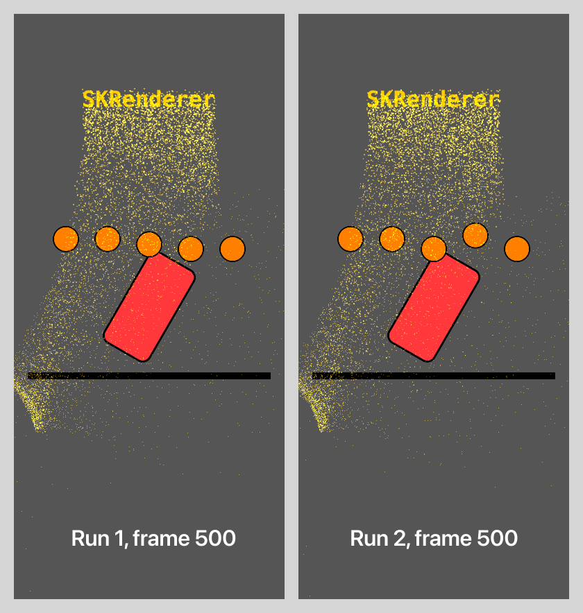

# SKRenderer Demo


This app demonstrates:

- Setting up SKRenderer to render a SpriteKit scene
- Recording a SpriteKit scene to an image sequence
- Recording a SpriteKit scene to video using IOSurface and AVFoundation
- Applying Core Image filters
- Exploring SpriteKit's update timing, physics engine clock, and determinism

## Usage

The app runs in Xcode Live Preview, Simulator, iOS device, and Mac Catalyst. Use the controls to adjust render settings.

When rendering starts, the live SKView is paused to free resources for the offline renderer. When rendering completes:

- Mac/Simulator/Live Preview: the file path is printed to the Xcode console
- iOS Device: a share sheet appears to save or share the file

### Render to Video

https://github.com/user-attachments/assets/7f72745a-1fcb-4a38-bb2d-84f55aabbca1

### Render to PNGs

https://github.com/user-attachments/assets/ef90bb02-be4c-443e-814e-61fd6c4bb38e

## SKRenderer

### Overview

SKRenderer takes a SpriteKit scene and outputs a metal texture. The texture can be used in a Metal pipeline:

- A Metal-backed view can display the output texture on screen, calling update and render each frame in sync with the display refresh rate.
- Views such as ARView can composite their own render texture with the one produced by SKRenderer. See ARView [RenderCallbacks](https://developer.apple.com/documentation/realitykit/arview/rendercallbacks-swift.struct) and [postProcess](https://developer.apple.com/documentation/realitykit/arview/rendercallbacks-swift.struct/postprocess).
- SKRenderer can run offscreen, with no view attached. In this mode, the app drives the update/render loop and retrieves the texture. This app uses that approach.

What SKRenderer is not:

- SKRenderer does not expose SKView internals such as its framebuffer. SKView and SKRenderer are separate rendering paths.
- SKRenderer is not magic. It's a renderer that needs the scene to be updated and computed at regular intervals. RealityKit and SceneKit can integrate SpriteKit content via SKRenderer, but only if the SpriteKit scene can update and render within the available frame budget. In practice, SpriteKit is light enough for this to work well.

### Setup

Below is the boilerplate setup done once when SKRenderer is created:

```swift
// Get the GPU

let device = MTLCreateSystemDefaultDevice()

// Factory for creating command buffers, used later each frame
// Command buffers = instructions for the GPU

let commandQueue = device.makeCommandQueue()

// Allocate GPU memory for the texture we'll render into
// Texture = a block of GPU memory holding pixels
// The memory allocation stays constant (let), the pixel data changes each frame

let textureDesc = MTLTextureDescriptor()
textureDesc.width = pixelWidth
textureDesc.height = pixelHeight
let renderTexture = device.makeTexture(descriptor: textureDesc)

// Create an SKRenderer instance and assign a scene to render

let renderer = SKRenderer(device: device)
renderer.scene = scene
```

Then for each frame, we run code in the following form:

```swift
// Update scene
// This calls all SKScene delegate functions, from update to didFinishUpdate

renderer.update(atTime: currentTime)

// Configure the rendering operation for this frame
// Set the created texture as the render target and specifies clear/store actions

let renderPassDescriptor = MTLRenderPassDescriptor()
renderPassDescriptor.colorAttachments[0].texture = renderTexture
renderPassDescriptor.colorAttachments[0].loadAction = .clear
renderPassDescriptor.colorAttachments[0].storeAction = .store

// Create a command buffer to hold this frame's GPU instructions

let commandBuffer = commandQueue.makeCommandBuffer()

// Viewport is required by the API but appears ignored by SKRenderer in this context
// The texture dimensions determine the actual output size

let viewport = CGRect(origin: .zero, size: sceneSize)

// Render the scene into the texture
// SKRenderer writes drawing commands into commandBuffer

renderer.render(
    withViewport: viewport,
    commandBuffer: commandBuffer,
    renderPassDescriptor: renderPassDescriptor
)

// GPU work is asynchronous with CPU work
// commit() submits work but returns immediately
// completion handler ensures GPU work is done for this frame

commandBuffer.addCompletedHandler {
    /// Do something with the completed texture, like image encoding
    encodeFrame(from: texture)
}

// Send the command buffer to GPU for execution

commandBuffer.commit()
```

### Resolution and Scale Factor

A SpriteKit scene is sized in points. A Metal texture is sized in pixels. If a scene is created at 1920x1080 and SKRenderer draws it, the output will be 1920x1080 pixels. In order to get Retina resolution, we must multiply the size of the allocated texture by a scale factor. SKRenderer will handle the mapping between the point-based scene and the pixel-based texture. This is reminiscent of UIView's [contentScaleFactor](https://developer.apple.com/documentation/uikit/uiview/contentscalefactor) property.

```swift
let scene = SKScene(size: CGSize(width: 1920, height: 1080))

// Scale allocated texture before rendering

let textureDesc = MTLTextureDescriptor()
textureDesc.width = Int(1920 * renderScale)  // @3x: 5760 pixels
textureDesc.height = Int(1080 * renderScale)  // @3x: 3240 pixels

renderer.render(...)
```

### Known Issues and Workarounds

HiDPI scaling doesn't work for all nodes. SKShapeNode with antialiasing enabled renders at @1x no matter the resolution of the Metal texture descriptor, and therefore will appear blurry at Retina scales. A workaround is to use supersampling: create shapes upsized by the scale factor, then scale them down:

```swift
let scaleFactor: CGFloat = 3 // iPhone Retina scale

let shape = SKShapeNode(rectOf: CGSize(width: 150 * scaleFactor, height: 75 * scaleFactor))
shape.lineWidth = 3 * scaleFactor
shape.setScale(1/scaleFactor)

// Physics body must match final size, not supersampled size

shape.physicsBody = SKPhysicsBody(rectangleOf: CGSize(width: 150, height: 75))
```

An alternative is to set `isAntialiased = false` on shape nodes, which will force SKRenderer to draw them at the correct resolution, but curves will appear jagged.

Textures created programmatically should also be scaled to match the Retina target. Pass the scale factor to the generator and scale texture creation accordingly:
```swift
let textureSize = CGSize(width: 2 * scaleFactor, height: 2 * scaleFactor)

// Generate a texture with Core Graphics

let cgRenderer = UIGraphicsImageRenderer(size: textureSize)
let squareTexture = SKTexture(image: cgRenderer.image { context in
    SKColor.white.setFill()
    context.fill(CGRect(origin: .zero, size: textureSize))
})
```

## Simulation Time

SpriteKit's update function takes a current time value, not a delta time. When the scene is updated with SKRenderer `update(atTime:)` method, the correct value must be passed. I found that time values must start from a `CACurrentMediaTime()` and not 0. Then, each tick, add a delta time:

```swift
var sceneTime: TimeInterval = CACurrentMediaTime()
let deltaTime = 1.0 / fps

for frame in 0..<totalFrames {
	let currentTime = sceneTime + deltaTime
    renderer.update(atTime: currentTime)
}
```

This time setup is called "monotonically increasing", i.e. the current time is positive and always increasing. I explored various delta time values to understand SpriteKit's internal clock for update, actions, and physics. Below are my findings. In each of these scenarios, current time starts at `CACurrentMediaTime()`.

### Backwards

A delta time is subtracted every frame:
- Actions with duration or delay > 0 are not ran
- Particles spawn but do not animate
- Physics bodies don't run
- Physics fields don't run
- The update function is called only twice

### Frozen

The same current time value is passed every frame:
- Actions with duration or delay > 0 are not ran
- Particles spawn but do not animate or change
- Physics bodies run at 1x speed
- Physics fields don't run

### Speed Control

A multiple of delta time is added every frame, and `scene.physicsWorld.speed` is set at different values.

`Delta time * 10, physicsWorld.speed = 1`:

- Actions run at 10×
- Particles sped up 10×
- Physics bodies run at 10x
- Physics fields run at 10x

`Delta time * 10, physicsWorld.speed = 0.1`:

- Actions run at 10×
- Particles run at 10×
- Physics bodies run at 1x (they look real-time, not sped up)
- Physics fields run at 10x

`physicsWorld.speed = 0`:

- Physics bodies don't run, regardless of current time
- Physics fields run at current time. Fields are not impacted by `physicsWorld.speed`

### Conclusion

- `physicsWorld.speed` sets the rate of the physics engine and is different from update's current time.
- `physicsWorld.speed` overrides the current time value IF the rate is not 1.
- For proper timing control: set both the current time AND `physicsWorld.speed` explicitly.

## Use Case: Recording

SKRenderer can be used to record a SpriteKit simulation. We can export the scene to a sequence of images or video.

### Export to PNG

- A fresh instance of the scene is passed to SKRenderer
- SKRenderer updates and renders each frame to a Metal render texture
- The render texture is copied with `texture.getBytes()` to raw pixel data
- Pixel data is converted to a CGImage, then to a PNG image

The `getBytes()` method is convenient, but slow for high performance needs. For high frame rates or large textures, PNG export is slower than video encoding due to this CPU copy and per-frame PNG compression.

### Export to Video

- A fresh instance of the scene is passed to SKRenderer
- SKRenderer updates and renders each frame to a Metal render texture
- The render texture is blit (fast GPU copy) to an IOSurface-backed texture
- The video writer transfers (memcpy) the IOSurface to CVPixelBuffer
- AVAssetWriter encodes the pixel buffer to H.264
- After all frames are encoded, AVAssetWriter finalizes the video file

Video export uses [IOSurface](https://developer.apple.com/documentation/iosurface), which is a low level memory management framework. IOSurface provides memory that both GPU and CPU can access quickly.

The blit is fast. The memcpy from IOSurface to CVPixelBuffer is faster than getBytes() from a Metal texture. Compared to PNG's getBytes(): this pipeline reduces per-frame overhead from ~5ms to <1ms on iPhone 13 at 1080p.

### Replay a Simulation

In order to record a specific segment of the simulation, the SpriteKit scene must be set up to recover a given state and replay the simulation. Typically this means having a deterministic state initializer + a command pattern on top of SpriteKit:
```swift
// Live interaction mutates the scene by issuing commands:

run(Command.create(..))
run(Command.move(..))

// The same interaction can be reproduced later:

history = [
    Action(time: 1.0, command: .create(...)),
    Action(time: 1.5, command: .move(...)),
    // ...
]
```

A recording pass would be implemented like this:

- Reset the scene to the desired initial state (nodes, transforms, assets…)
- Start the update loop
- At each frame, replay any commands scheduled for that timestamp
- Let SKRenderer render as many frames as needed for the interval
- Export the result to video or images 

This enables capturing complex simulations at any resolution and frame rate, fully decoupled from real-time display limits.

## Determinism

Interaction and behavior must be deterministic for frame-perfect replay. Consider the figure below: each render is from the same scene, and each image is the 500th frame of a 10 seconds simulation.



From empirical testing, I found the following to be deterministic:

- SKActions and typical code written in update
- Physics fields, including effects on particles like turbulence, appear predictable, which was a pleasant surprise!
- Particles themselves aren't identical from run to run, but the overall behavior is repeatable. Mind you, we can't "teleport" particles into a particular state. If the current state of a particle emitter is the result of an interaction with a field, the simulation must be replayed from the first interaction in order to recover the current state. 

I found the following to not be deterministic, despite the fixed time step supplied to the renderer:

- Colliding physics bodies. We can see that the bouncing balls above are in different positions at similar simulation time.

If your setup depends on precise physics body positions interacting over multiple seconds, use guide rails to direct the behavior, such as careful level design and checkpoints.

---

*Published 5 Nov 2025*  
*Updated 13 Jan 2026*
